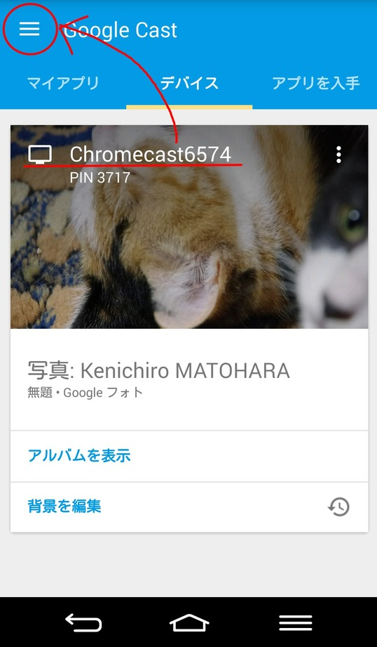
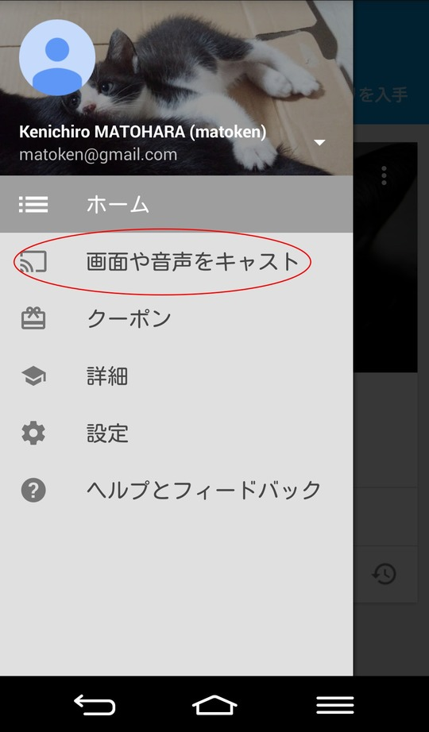
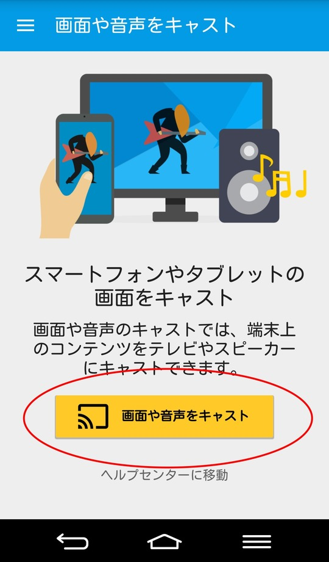
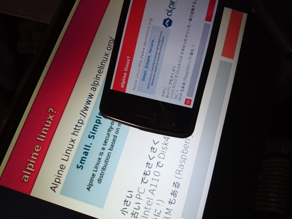
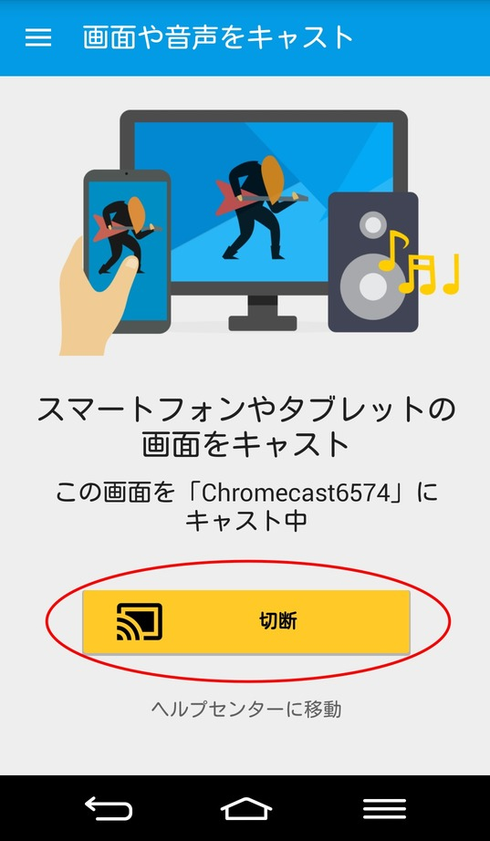
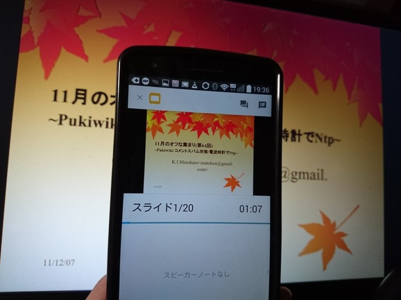

= AndroidでChromecastを使う
Kenichiro MATOHARA <matoken@gmail.com>
v1.0, 2016-05-20

ここではAndroidのGoogle Castアプリを使って画面をミラーリングする方法を説明する．

== Android用Google Castアプリの導入

以下のURLからGoogle Castアプリを導入しておく

* https://play.google.com/store/apps/details?id=com.google.android.apps.chromecast.app[Google Cast - Google Play の Android アプリ]

※Android 要件
4.0.3 以上

== Google Castアプリの利用

Google Castアプリを起動して，デバイスタブでChromecastが認識しているのを確認して左上のアイコンをタップ．

「画面や音声をキャスト」をタップ．

確認メッセージを「OK」ボタンで確認する．

image:image/Chromecast_Android03.jpg[]

「画面や音声をキャスト」ボタンを押すとキャスト出来る．表示したいコンテンツを表示する．

以下はSlideShareアプリを利用した時の例．

== キャストの終了

他の人がキャストをはじめると切断される．
自分で切断する場合は，Google Castアプリを起動して「切断」ボタンを押す．

== その他

* https://play.google.com/store/apps/details?id=com.google.android.apps.docs.editors.slides[Googleスライド - Google Play の Android アプリ] +
Chromecastへのキャスト機能がある．前もってローカルにデータをダウンロードしておいたほうが良い．

* https://www.linux.com/learn/how-stream-content-linux-system-chromecast[How to Stream Content from a Linux System to Chromecast | Linux.com | The source for Linux information] +
Androidアプリの https://play.google.com/store/apps/details?id=com.estrongs.android.pop[ES ファイルエクスプローラー]の Chromecastプラグイン(https://play.google.com/store/apps/details?id=com.estrongs.chromecast[ES Chromecast plugin])を利用してsamba内のコンテンツをキャストする手順．主に映像，音楽向け．画像もいけるのでスライドを画像で用意しておけば発表も出来そう．
