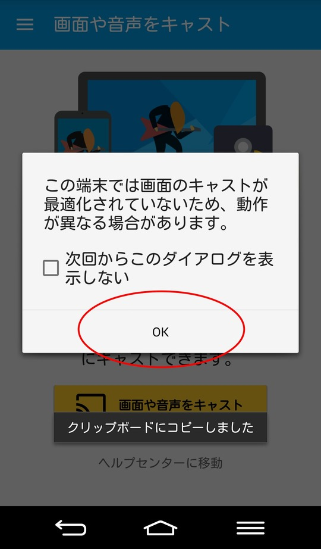

= AndroidでChromecastを使う
Kenichiro MATOHARA <matoken@gmail.com>
v1.0, 2016-05-20

ここではAndroidのGoogle Castアプリを使って画面をミラーリングする方法を説明する．

== Android用Google Castアプリの導入

以下のURLからGoogle Castアプリを導入しておく

* https://play.google.com/store/apps/details?id=com.google.android.apps.chromecast.app[Google Cast - Google Play の Android アプリ]

※Android 要件
4.0.3 以上

== Google Castアプリの利用

Google Castアプリを起動して，デバイスタブでChromecastが認識しているのを確認して左上のアイコンをタップ．

image:image/Chromecast_Android01.jpg[]

「画面や音声をキャスト」をタップ．

確認メッセージを「OK」ボタンで確認する．

「画面や音声をキャスト」ボタンを押すとキャスト出来る．表示したいコンテンツを表示する．

== キャストの終了

他の人がキャストをはじめると切断される．
自分で切断する場合は，Google Castアプリを起動して「切断」ボタンを押す．

image:image/Chromecast_Android05.jpg[]
