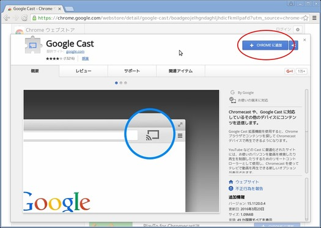
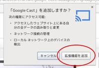
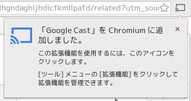
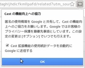
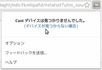
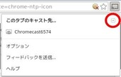
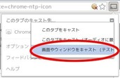
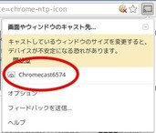
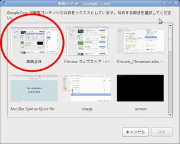
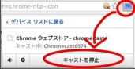

= Google Chrome/ChromiumでのChromecast利用例
Kenichiro MATOHARA <matoken@gmail.com>
v1.0, 2016-05-20

ここではGoogle Chrome / ChromiumのGoogle Cast拡張機能を利用して画面をキャストする方法を説明しています．

== Google Chrome / Chromiumの導入

ディストリビューションのパッケージや，以下のページから入手して導入する．

* https://www.google.com/chrome/browser/desktop/index.html[Chrome ブラウザ]

== Google Cast拡張機能の導入

Google Chrome / Chromium向けのGoogle Cast拡張機能が提供されている．
通常版とBetaの2つが提供されている．現代はどちらでも全画面Castが可能になっているのでお好みの方を導入する．（両方を導入することも可能）

Google Chrome/Chromiumで以下のURLにアクセスして導入する．

* https://chrome.google.com/webstore/detail/google-cast/boadgeojelhgndaghljhdicfkmllpafd?utm_source=chrome-ntp-icon[Google Cast - Chrome ウェブストア]
* https://chrome.google.com/webstore/detail/google-cast-beta/dliochdbjfkdbacpmhlcpmleaejidimm?utm_source=chrome-ntp-icon[Google Cast (Beta) - Chrome ウェブストア]

== 画面のキャスト

Chromecastをモニタに接続して電源の入った状態でGoogle CastのアイコンをクリックしてChromecastが認識しているのを確認．
左上のプルダウンボタンを押す．

「画面やウィンドウをキャスト」を選択する．

Chromecastを選択する．

画面の共有画面になるので，キャストしたいアプリケーションか「画面全体」を選ぶ．

== キャストの終了

他の人がキャストをはじめると切断される．
自分で切断する場合は，Google Chrome/ChromecastのGoogle Castのアイコンをクリックして「キャストを停止」を選ぶ．

